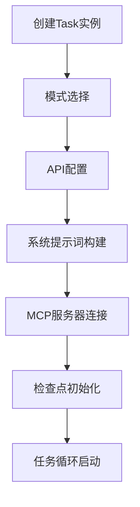
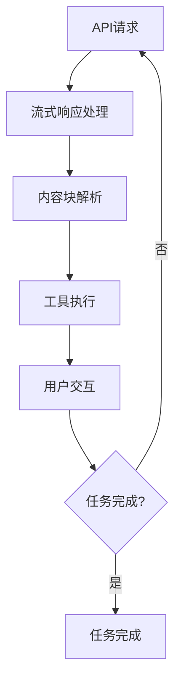
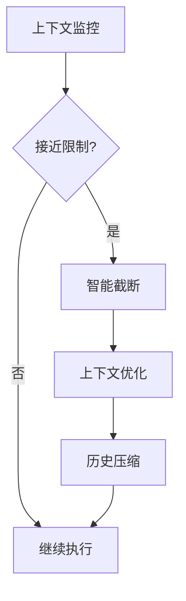

# Cline 实现指南与最佳实践

## 概述

本文档总结了 Cline 的完整实现流程，并提供了开发和使用的最佳实践指南。通过理解这些核心概念和实践，开发者可以更好地扩展 Cline 的功能，用户可以更高效地使用 Cline。

## 完整实现流程总结

### 1. 用户需求输入阶段
```mermaid
graph TD
    A[用户输入] --> B[消息验证]
    B --> C[@ 提及解析]
    C --> D[斜杠命令处理]
    D --> E[文件内容提取]
    E --> F[上下文信息收集]
    F --> G[用户指令集成]
    G --> H[最终消息构建]
```

**关键实现点**:
- 支持多种输入类型（文本、图片、文件）
- 智能解析特殊语法（@提及、/命令）
- 自动收集环境上下文信息
- 集成用户自定义规则

### 2. 任务初始化阶段


**关键实现点**:
- 根据任务类型选择合适的模式（Plan/Act）
- 动态构建包含工具定义的系统提示词
- 初始化检查点系统进行状态跟踪
- 建立 MCP 服务器连接

### 3. 任务执行循环阶段


**关键实现点**:
- 实时处理流式 API 响应
- 解析文本和工具调用块
- 执行工具并处理结果
- 管理用户审批流程

### 4. 上下文管理阶段


**关键实现点**:
- 监控 token 使用情况
- 智能截断对话历史
- 优化文件读取记录
- 保持关键上下文信息

## 核心设计模式

### 1. 责任链模式
```typescript
// 工具执行责任链
class ToolExecutor {
    private toolHandlers: Map<string, ToolHandler> = new Map([
        ["execute_command", new CommandToolHandler()],
        ["read_file", new ReadFileToolHandler()],
        ["write_to_file", new WriteFileToolHandler()],
        // ... 其他工具处理器
    ])
    
    async executeToolUse(block: ToolUse): Promise<void> {
        const handler = this.toolHandlers.get(block.name)
        if (handler) {
            await handler.execute(block, this.context)
        } else {
            throw new Error(`Unknown tool: ${block.name}`)
        }
    }
}
```

### 2. 观察者模式
```typescript
// 状态变更通知
class TaskStateManager {
    private observers: StateObserver[] = []
    
    addObserver(observer: StateObserver): void {
        this.observers.push(observer)
    }
    
    notifyStateChange(state: TaskState): void {
        this.observers.forEach(observer => observer.onStateChange(state))
    }
}
```

### 3. 策略模式
```typescript
// 不同模式的执行策略
interface ModeStrategy {
    buildSystemPrompt(): Promise<string>
    getAvailableTools(): string[]
    handleToolExecution(tool: ToolUse): Promise<void>
}

class PlanModeStrategy implements ModeStrategy {
    buildSystemPrompt(): Promise<string> {
        return buildPlanModePrompt()
    }
    
    getAvailableTools(): string[] {
        return ["read_file", "list_files", "plan_mode_respond"]
    }
}

class ActModeStrategy implements ModeStrategy {
    buildSystemPrompt(): Promise<string> {
        return buildActModePrompt()
    }
    
    getAvailableTools(): string[] {
        return ALL_TOOLS
    }
}
```

## 性能优化最佳实践

### 1. 流式处理优化
```typescript
// 增量内容处理
class StreamProcessor {
    private processedLength = 0
    
    async processChunk(chunk: string): Promise<void> {
        // 只处理新增内容
        const newContent = chunk.slice(this.processedLength)
        if (newContent.length > 0) {
            await this.processNewContent(newContent)
            this.processedLength = chunk.length
        }
    }
}
```

### 2. 内存管理
```typescript
// 及时释放大对象
class ResourceManager {
    private resources: Map<string, any> = new Map()
    
    async cleanup(): Promise<void> {
        // 清理不再需要的资源
        for (const [key, resource] of this.resources) {
            if (this.shouldCleanup(resource)) {
                await this.releaseResource(resource)
                this.resources.delete(key)
            }
        }
    }
}
```

### 3. 缓存策略
```typescript
// 多层缓存系统
class CacheManager {
    private memoryCache = new Map<string, any>()
    private diskCache = new DiskCache()
    
    async get(key: string): Promise<any> {
        // 1. 检查内存缓存
        if (this.memoryCache.has(key)) {
            return this.memoryCache.get(key)
        }
        
        // 2. 检查磁盘缓存
        const diskValue = await this.diskCache.get(key)
        if (diskValue) {
            this.memoryCache.set(key, diskValue)
            return diskValue
        }
        
        return null
    }
}
```

## 错误处理最佳实践

### 1. 分层错误处理
```typescript
// 不同层级的错误处理
class ErrorHandler {
    async handleError(error: Error, context: ErrorContext): Promise<void> {
        switch (context.level) {
            case "tool":
                await this.handleToolError(error, context)
                break
            case "api":
                await this.handleApiError(error, context)
                break
            case "system":
                await this.handleSystemError(error, context)
                break
        }
    }
    
    private async handleToolError(error: Error, context: ErrorContext): Promise<void> {
        // 工具级错误：重试或降级
        if (this.isRetryableError(error)) {
            await this.retryWithBackoff(context.operation)
        } else {
            await this.fallbackToAlternativeTool(context)
        }
    }
}
```

### 2. 优雅降级
```typescript
// 功能降级策略
class FeatureManager {
    async executeWithFallback<T>(
        primary: () => Promise<T>,
        fallback: () => Promise<T>
    ): Promise<T> {
        try {
            return await primary()
        } catch (error) {
            console.warn("Primary execution failed, falling back:", error)
            return await fallback()
        }
    }
}
```

## 扩展开发指南

### 1. 添加新工具
```typescript
// 1. 定义工具接口
export const newToolDefinition: ToolDefinition = {
    name: "NewTool",
    descriptionForAgent: "Description of what this tool does...",
    inputSchema: {
        type: "object",
        properties: {
            param1: { type: "string", description: "Parameter description" }
        },
        required: ["param1"]
    }
}

// 2. 实现工具执行逻辑
class NewToolHandler implements ToolHandler {
    async execute(block: ToolUse, context: ToolContext): Promise<ToolResponse> {
        const { param1 } = block.params
        
        // 执行工具逻辑
        const result = await this.performOperation(param1)
        
        return formatResponse.toolResult(result)
    }
}

// 3. 注册工具
toolRegistry.register("NewTool", new NewToolHandler())
```

### 2. 添加新的 API 提供商
```typescript
// 1. 实现 API 处理器
class NewProviderHandler implements ApiHandler {
    async *createMessage(
        systemPrompt: string,
        messages: Anthropic.Messages.MessageParam[]
    ): ApiStream {
        // 实现 API 调用逻辑
        const response = await this.callProviderApi(systemPrompt, messages)
        
        for await (const chunk of response) {
            yield this.transformChunk(chunk)
        }
    }
    
    getModel(): { id: string; info: ModelInfo } {
        return {
            id: "new-provider-model",
            info: {
                maxTokens: 100000,
                contextWindow: 128000,
                supportsImages: true,
                supportsPromptCaching: false
            }
        }
    }
}

// 2. 注册提供商
apiProviderRegistry.register("new-provider", NewProviderHandler)
```

### 3. 添加新的 MCP 服务器
```typescript
// 1. 创建服务器配置
const mcpServerConfig: McpServerConfig = {
    type: "stdio",
    command: "node",
    args: ["path/to/server.js"],
    env: {
        "API_KEY": "your-api-key"
    }
}

// 2. 注册服务器
await mcpHub.addServer("new-server", mcpServerConfig)

// 3. 实现服务器端逻辑（如果是自定义服务器）
class CustomMcpServer {
    async handleToolCall(name: string, args: any): Promise<any> {
        switch (name) {
            case "custom_tool":
                return await this.executeCustomTool(args)
            default:
                throw new Error(`Unknown tool: ${name}`)
        }
    }
}
```

## 用户使用最佳实践

### 1. 有效的需求描述
```markdown
# 好的需求描述示例
创建一个 React 组件用于显示用户资料卡片，要求：
1. 包含头像、姓名、邮箱、职位信息
2. 支持编辑模式和只读模式
3. 使用 TypeScript 和 Tailwind CSS
4. 包含单元测试

请先分析现有的组件结构 @/src/components，然后制定实现计划。
```

### 2. 合理使用 @ 提及
```markdown
# 提及相关文件和资源
请帮我修复这个登录功能的问题 @/src/auth/login.ts @problems

参考这个设计稿实现界面 @https://figma.com/design-link

查看终端输出了解错误信息 @terminal
```

### 3. 充分利用计划模式
```markdown
# 复杂任务先用计划模式
我需要重构整个用户管理系统，包括：
- 数据库模式更新
- API 接口重新设计  
- 前端组件重构
- 权限系统升级

请先切换到计划模式，分析现有架构并制定详细的重构计划。
```

### 4. 合理配置自动审批
```typescript
// 推荐的自动审批配置
const autoApprovalSettings = {
    enabled: true,
    approvedTools: [
        "read_file",           // 文件读取通常安全
        "list_files",          // 文件列表通常安全
        "list_code_definition_names" // 代码分析通常安全
    ],
    requireApprovalTools: [
        "execute_command",     // 命令执行需要审批
        "write_to_file",       // 文件写入需要审批
        "browser_action"       // 浏览器操作需要审批
    ]
}
```

## 故障排除指南

### 1. 常见问题诊断
```typescript
// 诊断工具
class DiagnosticTool {
    async diagnoseIssue(): Promise<DiagnosticReport> {
        return {
            contextWindowUsage: await this.checkContextUsage(),
            mcpServerStatus: await this.checkMcpServers(),
            checkpointHealth: await this.checkCheckpoints(),
            apiConnectivity: await this.checkApiConnectivity()
        }
    }
}
```

### 2. 性能问题解决
- **响应慢**: 检查上下文窗口使用情况，考虑截断历史
- **内存占用高**: 清理不必要的缓存，检查大文件处理
- **工具执行失败**: 检查权限设置和环境配置

### 3. 集成问题解决
- **MCP 连接失败**: 检查服务器配置和网络连接
- **API 调用错误**: 验证 API 密钥和配额限制
- **检查点问题**: 检查 Git 配置和存储权限

## 总结

Cline 的实现展现了现代 AI 编程助手的复杂性和强大功能。通过理解其核心架构和实现细节，开发者可以：

1. **扩展功能**: 添加新的工具、API 提供商和 MCP 服务器
2. **优化性能**: 改进流式处理、内存管理和缓存策略
3. **增强稳定性**: 完善错误处理和恢复机制
4. **提升用户体验**: 优化交互流程和响应速度

用户可以通过遵循最佳实践：

1. **高效沟通**: 使用清晰的需求描述和合适的提及语法
2. **合理配置**: 根据需要配置自动审批和模式选择
3. **充分利用**: 发挥计划模式和 MCP 集成的优势
4. **问题解决**: 快速诊断和解决常见问题

Cline 的设计理念体现了 AI 与人类协作的未来方向：既保持 AI 的强大能力，又确保人类的控制权和安全性。这种平衡使得 Cline 成为了一个既强大又可信赖的编程助手。
